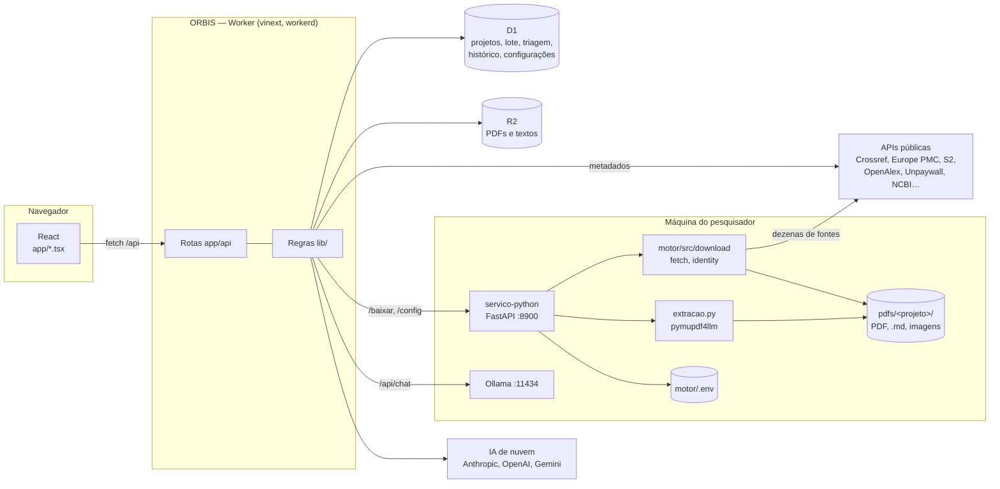
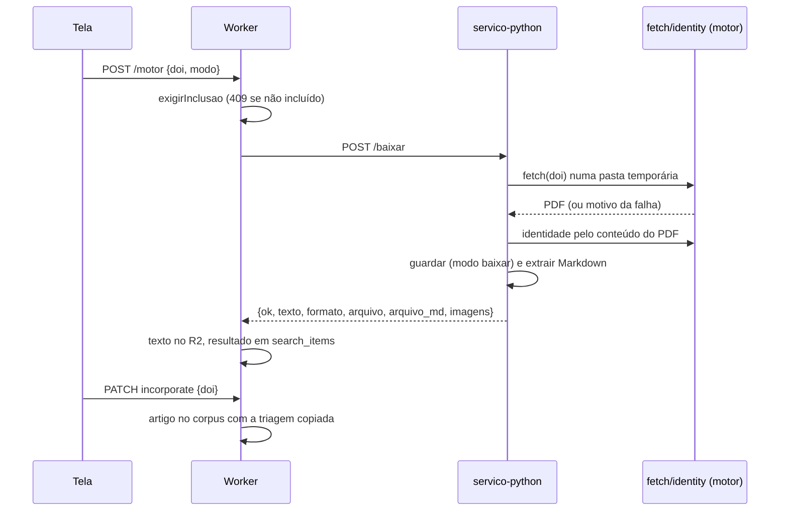

# ORBIS — arquitetura

Para quem vai mexer no código. O que o sistema faz, do ponto de vista de quem
usa, está em [SISTEMA.md](SISTEMA.md); como instalar e rodar, em
[COMO_RODAR.md](../COMO_RODAR.md).

## Visão geral

Três partes, com fronteiras nítidas:

- **ORBIS** (`app/`, `lib/`, `db/`, `drizzle/`): interface React e API sobre um
  Cloudflare Worker, com banco D1 e arquivos no R2. Em casa, tudo roda
  localmente (`@cloudflare/vite-plugin` sobe o workerd; D1 e R2 ficam em
  `.wrangler/state/`). Funciona sozinho.
- **servico-python** (`servico-python/`): FastAPI em `127.0.0.1:8900`. É o
  que o Worker não consegue fazer — biblioteca nativa (PyMuPDF), a cadeia
  completa de download e a gravação no disco do pesquisador. Opcional.
- **motor** (`motor/`): o motor Python de revisão sistemática, com CLI
  própria. O serviço usa só `motor/src/download` (`fetch`, `identity`).

O `start.py` sobe os dois processos, aplica migrações novas ao D1 local e
entrega ao Worker `ORBIS_ENGINE_URL` e `ORBIS_ENGINE_TOKEN` (declarados nos
`vars` do `vite.config.ts` — o Worker só enxerga o que for declarado ali).

## ORBIS: interface e Worker

### Identidade, papéis e concorrência

- A identidade vem dos cabeçalhos `oai-authenticated-user-*` postos pela
  hospedagem. Em desenvolvimento, `build/sites-vite-plugin.ts` injeta um
  usuário local (cookie `__sites_local_auth`).
- `lib/server.ts`: `identity()` recusa requisições que mudam dados vindas de
  outra origem; `owned()` resolve o papel (`owner`, `editor`, `reviewer`,
  `viewer`) pela tabela `project_members`; `requireRole()` barra o resto.
  Revisores só podem registrar triagem, pareceres e revisão geral.
- O estado estruturado do projeto é um JSON em `projects.state` (até 1,8
  milhão de caracteres), com **concorrência otimista**: toda mudança manda a
  `revision` que leu; `commit()` grava o estado novo e um evento em `events`
  (o histórico) numa única transação, ou devolve 409.
- O que cresce com o número de registros fica **fora** desse JSON, em tabelas
  próprias: o lote de DOIs (`search_items`) e a triagem de títulos e resumos
  (`screening`).

### Rotas

| Rota | Faz |
| --- | --- |
| `GET/POST /api/projects` | lista e cria projetos |
| `GET /api/projects/:id` | projeto, documentos, lote (`searches`) e linhas de triagem (`screening`) |
| `PATCH /api/projects/:id` | ações sobre o estado: `protocol`, `planner`, `triage`, `fulltext`, `finalReview`, `incorporate`, `runAI`, `importAI`, `clearStage`, `restore`… |
| `POST /api/projects/:id/search` | lote de DOIs: `queue`, `database` (busca numa base), `prefetch` (Semantic Scholar em lote) e a consulta de um DOI |
| `POST /api/projects/:id/screening` | triagem de títulos e resumos: `decide`, `ai`, `acceptAI`, `refreshAbstract` |
| `GET/POST /api/projects/:id/motor` | estado do motor; download de um artigo pelo motor (fase 1 do lote) |
| `GET/POST /api/projects/:id/pdf` | PDFs no R2 (baixar, enviar, buscar e salvar) |
| `GET/POST /api/projects/:id/texto` | texto extraído (`text/markdown` ou `text/plain`); gravação na restauração |
| `/api/projects/:id/members`, `/history`, `/api/invitations` | equipe, histórico, convites |
| `GET/PUT/POST /api/settings` | Configurações: ler, gravar, **Testar** |

### Módulos de `lib/`

| Módulo | Papel |
| --- | --- |
| `domain.ts`, `validation.ts`, `review.ts` | estado do projeto, triagem (`triageDecision` e regras por pergunta), pareceres, adjudicação, PRISMA |
| `screening.ts` / `screening-db.ts` | regras puras da triagem pré-download / leitura e gravação da tabela `screening` |
| `article-resolver.ts`, `sources/*` | metadados por DOI; busca em PubMed, LILACS, Cochrane, Embase |
| `incorporate-pdf.ts`, `pdf-transfer.ts`, `identity.ts`, `remote.ts` | download pelo próprio Worker, validação do PDF, identidade por metadados, bloqueio de endereços privados |
| `python-bridge.ts`, `motor-download.ts` | chamadas ao servico-python; como o resultado do motor vira artigo |
| `ai-analysis.ts` | pacote enviado à IA, leitura da resposta (`ORBIS_AI_RESULTS_V1`), concordância, "análise atual" |
| `ai-provider.ts`, `ai-runner.ts` | provedores de IA e escolha; execução em lotes (`limit`/`remaining`) |
| `settings.ts`, `settings-store.ts`, `settings-test.ts` | catálogo de Configurações e regras puras; D1; botões Testar |
| `backup.ts` | formato `.orbis` (ZIP com manifesto, PDFs e textos) |

Arquivos de `lib/` sem imports de rede (`settings.ts`, `screening.ts`,
`domain.ts`…) são carregados direto pelos testes, sem build.

## Dados e armazenamento

### D1

| Tabela | Conteúdo |
| --- | --- |
| `projects` | nome, dono, `state` (JSON), `revision`, bytes usados, arquivamento |
| `project_members` | convites e papéis |
| `events` | histórico: cada `commit()` com quem, ação, revisão e o que mudou |
| `search_items` | lote de DOIs: situação da consulta e `result` (metadados, resumo, links, resultado do motor) |
| `pdf_attempts` | tentativas de download pelo Worker e motivos |
| `documents` | PDFs guardados no R2 |
| `screening` | triagem de títulos e resumos: decisão, respostas, motivos, autor, versão do protocolo, origem, última sugestão de IA |
| `settings` | Configurações salvas pela tela (chave = nome da variável de ambiente) |

Migrações em `drizzle/` (geradas por `pnpm db:generate` a partir de
`db/schema.ts`). O `start.py` aplica as novas sozinho e registra as aplicadas
em `orbis_migrations`.

### R2

- PDFs guardados pelo Worker (30 MB por arquivo, 2 GB por projeto, com
  reserva de cota antes do envio).
- Textos extraídos pelo motor em `<projeto>/texto/<sha256 do DOI>.txt`
  (`textKey`); o formato (`markdown` ou `texto`) fica em `article.texto`.
  `ownKey()` garante que um projeto só lê e apaga chaves suas — um backup
  restaurado não aponta para textos de outro projeto.

### Máquina do pesquisador

`<dados>` = `$ORBIS_DATA_DIR` ou `motor/`:

- `<dados>/pdfs/<projeto>/` — PDF, `<nome>.md`, `<nome>_imagens/`,
  `Relatório.txt` e `.orbis-index.json` (nome do arquivo por DOI);
- `<dados>/data/orbis-token` — segredo do `/config` (permissão 600);
- `motor/.env` — chaves e opções do motor.

## Fluxos principais

### Identificação e triagem de títulos e resumos

1. `search`/`queue` (ou `database`) grava os DOIs em `search_items`; a tela
   consulta cada um em paralelo (`ORBIS_LOTE_SIMULTANEOS`, 1–4), com
   *lease* por DOI para duas abas não consultarem o mesmo.
2. `resolveArticle()` junta Crossref, Europe PMC, Semantic Scholar, OpenAlex,
   DataCite e Unpaywall. Consultar **não baixa nada**.
3. `registroDe()` transforma cada linha consultada com metadados num
   registro. A tela lista, filtra e pagina no navegador (`listar()`); as
   ações que gravam vão para `/screening`.
4. Uma decisão só vale na versão do protocolo em que foi tomada
   (`situacao()`); a sugestão de IA só é "atual" com a mesma versão, o mesmo
   hash de critérios e o mesmo hash do registro (`sugestaoAtual()`).

### Obtenção do texto completo

A fase 1 (`/motor`) não toca no estado do projeto — só na linha do DOI —, então
a tela roda 4 downloads em paralelo sem conflito de revisão. A fase 2
(`incorporate`) cria o artigo. Sem motor, `incorporate` usa
`incorporateWithPdf()`: baixa pelo Worker, valida e guarda no R2. Nos dois
caminhos, um DOI com registro de triagem só entra se estiver incluído na
versão atual, e leva a decisão junto (`triagemParaArtigo()`).

### Cascata de download e identidade (motor)

`fetch.fetch(doi)` tenta, em ordem, e para no primeiro PDF com identidade
confirmada: Unpaywall → PMC no AWS → Semantic Scholar → OpenAlex → arXiv →
Europe PMC/PMC/PubMed → bioRxiv/medRxiv → ACL → CORE → sessão institucional →
LibGen → Crossref → página da editora → XML de editora → resolvedor DOI →
Open Access Button → Sci-Hub → OSTI → OpenAlex Content → Wayback → Anna's
Archive. Cada fonte pode ser desligada por `PAPER_FETCH_NO_*`.

O PDF passa por `validate_pdf_data` (`%PDF`, tamanho, páginas legíveis,
`%%EOF`) e pelo portão de identidade (`identity.validate_article_identity`):
DOI impresso no PDF; ou o registro com o DOI certo sem título contraditório;
ou título mais autor, ano ou periódico. Material suplementar e PDFs de outro
artigo são apagados — inclusive no modo "baixar". O download acontece sempre
numa pasta temporária por artigo; `_guardar()` move para a pasta do projeto
sob trava, com o índice `.orbis-index.json` evitando que dois artigos com o
mesmo nome gerado se sobrescrevam. Detalhes e medições em
[motor/ANALISE.md](../motor/ANALISE.md).

### Extração (`servico-python/extracao.py`)

- `pymupdf4llm.to_markdown` roda em **processos à parte** com prazo
  (`ORBIS_EXTRACAO_PRAZO`, padrão 90 s): só um processo pode ser
  interrompido. Os processos (`Trabalhadores`, `spawn`, até 4 — o mesmo
  limite de downloads simultâneos) ficam vivos entre um artigo e outro,
  porque importar o `pymupdf4llm` custa mais que extrair; o que estoura o
  prazo ou cai é morto e substituído no próximo artigo.
- No modo "baixar", o processo trabalha na pasta do projeto e grava as
  imagens em `<nome>_imagens/` com links relativos; no modo "analisar" não
  recebe pasta e nada fica no disco.
- Falha ou prazo estourado: texto simples do PyMuPDF, `formato: 'texto'` e
  `aviso_extracao`; a pasta de imagens pela metade é apagada.
- O texto enviado ao ORBIS é cortado em `LIMITE_TEXTO` (com
  `texto_truncado`); o `.md` no disco é inteiro.
- Opções lidas a cada artigo (`ORBIS_EXTRAIR_MARKDOWN`,
  `ORBIS_SALVAR_IMAGENS`): a tela de Configurações muda o `os.environ` do
  motor na hora.

### IA

- `makeAIPackage()` monta o pedido: critérios do protocolo, instruções e um
  item por artigo (título, resumo e `resumo_status`; na PCC, o texto
  completo). `buildUserPrompt()` o serializa; a resposta volta em
  `ORBIS_AI_RESULTS_V1` e entra por `importAI()` — a mesma porta da
  importação manual, com as mesmas regras de duplicata, contexto e
  divergência.
- `pickProvider(valores)` lê um registro plano de configurações
  (`ORBIS_IA_PROVEDOR`, chaves, `ORBIS_IA_MODELO_*`, `OLLAMA_*`). Automático
  = Ollama se `/api/tags` responde em 2 s, senão Anthropic → OpenAI → Gemini.
- `callWithRetry()` repete só o transitório (429, 5xx, rede) com backoff; o
  que falha vira `LlmCallFailed`, registrado como falha técnica, nunca como
  parecer. Prazo estourado do Ollama não é repetido.
- `runAITriage(..., {limit})` processa só os pendentes — artigos sem análise
  atual do **mesmo** provedor e modelo — e devolve `remaining`; a tela repete
  até zerar, com **Pausar** entre lotes (`ORBIS_IA_LOTE`, padrão 10).
- Ollama: `/api/chat` com `stream:false`, `format:'json'`, `think:false`,
  `temperature:0`, `num_ctx` = `OLLAMA_CONTEXTO`. Como o contexto é curto, o
  texto completo é cortado em `(num_ctx − 6000) × 3` caracteres e a PCC local
  vai um artigo por chamada.

### Configurações

- `lib/settings.ts` é o **catálogo único**: chave (= nome da variável de
  ambiente), grupo, tipo, limites, padrão, destino (`orbis`, `motor`,
  `ambos`), aliases e se exige reiniciar o motor. A tela desenha os campos a
  partir dele; o servidor valida por ele.
- Resolução no ORBIS: **tela (D1) → ambiente → padrão**. Sem a tabela
  `settings` (migração não aplicada), vale o ambiente.
- Itens do motor vão por `PUT /config` ao servico-python, que grava o
  `motor/.env` preservando comentários e ordem (substitui a linha, descomenta
  a do modelo ou acrescenta no fim) e atualiza `os.environ`. A cópia nova
  herda a permissão do arquivo (um `chmod 600` continua valendo); um
  `.env` criado pela tela nasce `600`.
  `config_env.PERMITIDAS` e o catálogo são conferidos por teste de paridade.
- Booleanos ligados por padrão gravam `0` ao desligar; os desligados por
  padrão (`PAPER_FETCH_NO_*`) são apagados.

## Segurança

- Chaves nunca entram no repositório (`.gitignore`: `.env*`, `motor/.env`,
  `motor/data/`) nem voltam inteiras ao navegador: só `••••` e os 4 últimos
  caracteres, e nem isso abaixo de 12 caracteres. `semSegredos()` limpa as
  mensagens de erro (a chave do Gemini vai na URL).
- Valores com `\r`, `\n` ou `\0` são recusados (injeção de linha no `.env`).
- `PUT` e `POST /api/settings` só aceitam pedidos para `localhost`,
  `127.0.0.1` ou `::1`: num ORBIS hospedado, qualquer pessoa logada mudaria a
  instalação de todos (por exemplo, `OLLAMA_URL` apontando para um servidor
  seu, recebendo os textos dos projetos dos outros). Lá a tela é só leitura
  (`editavel:false`) e valem as variáveis de ambiente.
- O motor escuta só em `127.0.0.1` e aceita CORS de qualquer origem; por isso
  `/config` exige `X-Orbis-Token` (comparação em tempo constante). O token é
  criado uma vez pelo `start.py` e trafega só entre servidores.
- Downloads pelo Worker checam, por DNS, que o destino é público e conferem a
  assinatura do PDF antes de guardar; a cota é reservada antes e devolvida em
  caso de falha.
- Um DOI não entra no corpus sem inclusão na triagem (409), nem sem PDF
  validado.

## Testes

| Comando | Cobre |
| --- | --- |
| `for t in tests/*.mjs; do node "$t"; done` | regras, fontes, IA, backup, triagem, configurações; os `*-integration.mjs` sobem o Worker compilado no Miniflare com D1/R2 temporários e simulam motor, Ollama e fontes (exigem `pnpm build`) |
| `pnpm exec tsc --noEmit` | tipos |
| `cd servico-python && ../motor/.venv/bin/python -m pytest -q` | download, extração, rotas, `.env`, token |
| `cd motor && .venv/bin/python -m pytest -q` | motor |

Os testes da interface carregam o TypeScript direto (`stripTypeScriptTypes`),
sem `pnpm install`. Nenhum teste depende da internet.

## Como estender

- **Nova base de busca**: `lib/sources/<base>-search.ts` (URL, parse,
  `search<Base>()`), uma entrada em `lib/sources/bases.ts` e em
  `searchBase()`, teste em `tests/sources.mjs`.
- **Nova configuração**: um item em `CATALOGO`. Se for do motor, também em
  `config_env.PERMITIDAS` — o teste de paridade falha se esquecer.
- **Novo provedor de IA**: uma fábrica em `lib/ai-provider.ts`, a opção em
  `ORBIS_IA_PROVEDOR`, as chaves no catálogo e um alvo em `settings-test.ts`.
- **Nova fonte de download**: `motor/src/download/fetch.py`, com `_can_try` e
  um `PAPER_FETCH_NO_*` para desligá-la.
- **Nova tabela**: `db/schema.ts`, `pnpm db:generate`, renomear a migração
  gerada para um nome descritivo (e o `tag` no `_journal.json`), levá-la ao
  backup (`lib/backup.ts`) e à limpeza de etapas (`clearStage`) se for dado
  do projeto.
