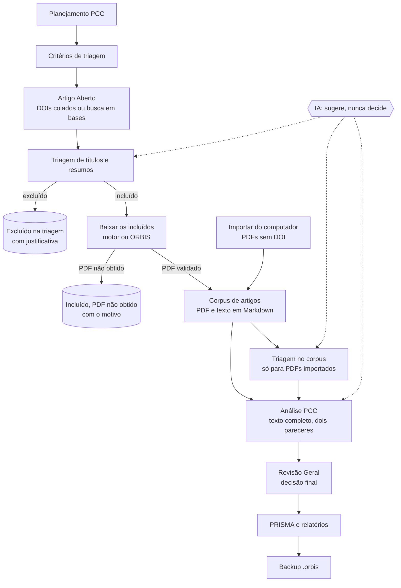

# ORBIS — como o sistema funciona

Este texto é para quem vai usar o ORBIS ou precisa entender o que ele faz:
pesquisadores, orientadores, bibliotecários. Não pressupõe conhecimento de
programação. Quem vai mexer no código deve ler também
[ARQUITETURA.md](ARQUITETURA.md).

## O que é o ORBIS

O ORBIS organiza uma revisão sistemática ou de escopo do começo ao fim, na
ordem em que ela acontece de fato:

1. **planejar** o protocolo (a pergunta, o PCC e os critérios);
2. **identificar** os estudos (por DOI ou por busca em bases);
3. **triar** por título e resumo;
4. **obter o texto completo** só do que passou na triagem;
5. **avaliar** o texto completo pelos critérios do protocolo;
6. **relatar** o caminho de cada artigo (PRISMA) e guardar tudo em backup.

Ele roda no seu computador. A interface abre no navegador
(<http://localhost:5173>), e um serviço auxiliar em Python, o **motor**, cuida
do que o navegador não consegue fazer sozinho: buscar o PDF em dezenas de
fontes, conferir se o PDF é mesmo o artigo pedido e extrair o texto de dentro
dele.

A inteligência artificial ajuda em várias etapas, mas **nunca decide**. Toda
decisão que conta (incluir, excluir, o parecer final) é de uma pessoa, e fica
registrada com o nome de quem a tomou e a versão do protocolo em vigor.

## O fluxo, etapa por etapa

### 1. Projeto e equipe

Cada revisão é um **projeto**. Quem cria é o *coordenador* (dono) e pode
convidar pessoas por e-mail em **Visão do projeto**, com um de três papéis:

| Papel | O que pode fazer |
| --- | --- |
| Colaborador | tudo o que o coordenador faz, menos gerenciar a equipe e excluir o projeto |
| Revisor | triar (títulos e resumos, e no corpus), aceitar sugestões da IA, registrar pareceres e a revisão geral |
| Somente leitura | ver o projeto e os relatórios |

### 2. Planejamento PCC

Em **Planejamento PCC** você define o objetivo, a pergunta e o PCC
(População, Conceito, Contexto), além dos critérios de inclusão e exclusão.
Pode anexar documentos de base (DOCX, TXT, MD, JSON) e pedir a uma IA uma
proposta — mas a proposta só entra quando você a aprova, item a item.

O protocolo tem **versão**. Quando você muda e aprova de novo, a versão sobe, e
as decisões tomadas sob a versão anterior passam a aparecer como "decisão de
versão anterior": continuam visíveis, mas o artigo volta a ficar pendente.
Nada é apagado.

### 3. Critérios de triagem

Em **Critérios de triagem** ficam as perguntas da triagem, escritas de forma
positiva ("O estudo avalia adultos com dor lombar?"). Cada pergunta é
respondida com **Sim**, **Não** ou **Indeterminado**, e você configura o que
cada resposta faz. O padrão é: "Não" exclui, e exige justificativa;
"Indeterminado" mantém o artigo para a leitura do texto completo.

### 4. Artigo Aberto — identificação

Aqui entram os registros. Duas formas:

- **colar uma lista de DOIs** (até 500 por lote);
- **buscar numa base**: PubMed, LILACS, Cochrane (revisões CDSR) ou Embase.
  Os DOIs dos resultados entram no mesmo lote.

Cada DOI é consultado em fontes públicas de metadados (Crossref, Europe PMC,
Semantic Scholar, OpenAlex, DataCite, Unpaywall e a página da editora) para
trazer título, autores, ano, periódico e **resumo**. O lote fica salvo no
projeto: se você fechar a aba, **Retomar e reconsultar pendentes** continua de
onde parou.

Nesta etapa **nada é baixado**. Ao terminar, o ORBIS avisa quantos registros
estão prontos para a triagem.

### 5. Triagem de títulos e resumos

Cada DOI que trouxe metadados vira um **registro** para triar. A tela mostra:

- filtros com contagem: *pendentes*, *incluídos*, *excluídos*, *sem resumo*,
  *todos* — e uma busca por título, autor, DOI, periódico ou resumo;
- uma lista de 50 registros por página;
- a **ficha** do registro: título, autores, ano, periódico, o resumo e de onde
  ele veio, e as perguntas do protocolo para responder.

Sem resumo, a ficha avisa e oferece **Buscar resumo de novo**, que consulta as
fontes outra vez. Dá para decidir só pelo título, se o protocolo permitir.

Exige o protocolo aprovado. As regras são as mesmas da triagem clássica: todas
as perguntas respondidas, e exclusão só com justificativa.

**Sugerir com IA** pede ao provedor configurado (modelo local ou de nuvem) uma
sugestão para os registros pendentes, em lotes, com progresso e um botão
**Pausar**. A sugestão aparece na ficha — a resposta e a evidência de cada
pergunta — e pode ser **aceita** uma a uma, ou em bloco depois de conferir uma
amostra. Enquanto ninguém aceita, ela é só uma sugestão: o registro continua
pendente. Se o protocolo, os critérios ou o próprio resumo mudarem, a
sugestão antiga deixa de valer e não pode mais ser aceita.

### 6. Baixar os incluídos — obtenção do texto completo

O botão **Baixar os incluídos** busca o PDF de cada registro incluído na
versão atual do protocolo que ainda não está no corpus.

Com o **motor** no ar, o PDF é procurado numa cascata de mais de vinte fontes
(Unpaywall, PubMed Central, Semantic Scholar, OpenAlex, Europe PMC, CORE,
repositórios, a página da editora e outras). Um PDF só é aceito depois de
conferida a **identidade**: o DOI impresso no próprio arquivo, ou o título e
os autores. Material suplementar, formulário de submissão ou o artigo errado
são descartados.

O projeto escolhe o **modo de download**:

- **Analisar e baixar os PDFs** — o PDF fica numa pasta do seu computador
  (`motor/pdfs/<projeto>/`), com um `Relatório.txt` do que foi feito;
- **Só analisar no sistema** — o PDF é lido e apagado; nada fica no seu
  computador.

Nos dois modos o texto do artigo é extraído em **Markdown** (seções, títulos e
tabelas preservados), e é esse texto que a IA lê na análise PCC. No modo
"baixar", o `.md` fica ao lado do PDF e as imagens do artigo numa pasta
`<nome>_imagens/`. Se a extração em Markdown falhar ou demorar demais, vale o
texto simples, e o artigo entra assim mesmo.

Sem o motor, o ORBIS tenta sozinho pelas fontes abertas que conhece e guarda o
PDF no próprio sistema (sem extrair o texto).

O artigo entra no corpus **com a decisão de triagem copiada**. O que não
baixar fica como *incluído, PDF não obtido*, com o motivo, e o botão pode ser
usado de novo mais tarde. Em geral só metade de um acervo tem cópia aberta em
algum lugar; o resto depende do acesso institucional (veja
[COMO_RODAR.md](../COMO_RODAR.md)).

### 7. Importar do computador

PDFs que você já tem, com ou sem DOI, entram por **Importar do computador**.
Eles não passam pela triagem de títulos e resumos: vão direto ao corpus e são
triados lá.

### 8. Corpus de artigos

O **corpus** reúne os artigos com texto completo. A ficha de cada um mostra o
PDF (baixar), o texto extraído (**Abrir texto**, **Baixar .md**), onde o
arquivo ficou no seu computador, o tipo documental (artigo, protocolo de
estudo, editorial…) e se ele segue para a triagem.

### 9. Triagem no corpus

A etapa **Triagem** continua existindo para o que não passou pela triagem de
títulos e resumos: PDFs importados do computador e projetos anteriores a ela.
Funciona igual, inclusive com análises de IA importadas ou geradas.

### 10. Análise PCC — texto completo

Os artigos incluídos na triagem são avaliados pelo texto completo, critério a
critério. Dois pareceres independentes são registrados separadamente; se
divergem, uma terceira pessoa **adjudica**. A IA pode analisar cada artigo
pelo texto extraído e indicar, para cada critério, se atende, o motivo, a
evidência e a página — como rascunho para o avaliador.

### 11. Revisão Geral

A decisão final sobre os artigos que passaram pela análise PCC, preservando o
registro das etapas anteriores.

### 12. PRISMA e relatórios

O fluxograma PRISMA é montado a partir das decisões registradas:
identificados, triados, excluídos na triagem (com os motivos), buscados para
obtenção, não obtidos, avaliados no texto completo e incluídos. Há também
relatórios em HTML (para imprimir em PDF), Word e CSV, e a lista de excluídos
com o motivo de cada um.

### 13. Backup e histórico

**Backup e histórico** gera um arquivo `.orbis` com o projeto inteiro: o
protocolo, as decisões, as análises de IA, o lote de DOIs, a triagem de
títulos e resumos, os PDFs e os textos extraídos. O arquivo pode ser
restaurado em um projeto novo, inclusive em outra máquina. Toda alteração
salva fica no histórico, com quem fez e quando.

## O papel da IA

| A IA faz | A IA nunca faz |
| --- | --- |
| propõe o PCC e as perguntas de triagem a partir dos seus documentos | aprova o protocolo |
| sugere a resposta de cada pergunta da triagem, com a evidência | inclui ou exclui um artigo sozinha |
| analisa o texto completo critério a critério | registra um parecer em nome de alguém |
| aponta possíveis duplicatas | apaga qualquer coisa |

Toda sugestão guarda **qual IA** a fez (provedor e modelo), **quando** e sob
qual versão do protocolo. Várias IAs podem analisar o mesmo artigo; o ORBIS
mostra onde concordam e onde divergem. Uma chamada que falha não vira
"sugestão": o artigo continua pendente e o motivo aparece na tela.

Os provedores:

- **Local (Ollama)** — um modelo que roda na sua própria máquina, por padrão o
  `qwen3:14b`. Os textos não saem do computador. Precisa do
  [Ollama](https://ollama.com) instalado e de uma placa de vídeo com memória
  suficiente (16 GB para o `qwen3:14b`). É mais lento: cerca de 15 a 25
  segundos por registro na triagem.
- **Nuvem** — Anthropic, OpenAI ou Gemini, com uma chave sua.

Em **Configurações** você escolhe: *automático* (o modelo local, se o Ollama
estiver aberto; senão, a primeira chave de nuvem cadastrada), *local*, ou um
provedor fixo. Um provedor fixo sem chave não é trocado por outro às
escondidas: a IA fica indisponível até a chave ser cadastrada.

Também é possível trabalhar sem nenhuma IA conectada: **Exportar artigos para
IA** gera um pacote que você leva a qualquer IA, e a resposta volta por
**Ler resposta JSON**.

## Configurações

O item **Configurações**, na barra lateral, reúne o que varia de uma
instalação para outra, em cinco blocos:

| Bloco | O que tem |
| --- | --- |
| Bases de busca | chaves do NCBI e da Elsevier/Embase, base padrão, limite de resultados |
| IA | provedor preferido, chaves e modelos de nuvem, Ollama (endereço, modelo, contexto, prazo), tamanho do lote |
| Triagem e lote | consultas simultâneas, modo de download de projetos novos |
| Extração do texto | Markdown ligado ou não, salvar imagens, prazo da extração |
| Fontes de download | e-mail do Unpaywall, chaves de OpenAlex, Semantic Scholar, CORE, Springer, Wiley; fontes que podem ser desligadas |

Cada bloco tem botões **Testar**, que fazem uma chamada real mínima e dizem se
a chave funciona. As chaves nunca aparecem inteiras na tela — só os quatro
últimos caracteres. Ao lado de cada item, uma etiqueta diz de onde vem o valor:
*salvo aqui*, *do ambiente* ou *padrão*.

As configurações só podem ser alteradas na instalação local (o ORBIS aberto
pelo `start.py`). Num ORBIS publicado na internet para a equipe, a tela fica
só de leitura e valem as variáveis de ambiente da hospedagem — senão qualquer
pessoa logada poderia mudar, por exemplo, para onde vão os textos analisados
pela IA.

O acesso institucional (sessão CAPES/CAFe, EZproxy, proxy) não está na tela:
continua sendo configurado no arquivo `motor/.env`, como explica o
[COMO_RODAR.md](../COMO_RODAR.md).

## Onde ficam os dados

Tudo fica no seu computador.

| O quê | Onde |
| --- | --- |
| Projetos, decisões, histórico, lote de DOIs, triagem, configurações | banco local em `.wrangler/state/` |
| PDFs guardados pelo ORBIS e textos extraídos | mesmo lugar, no armazenamento de arquivos local |
| PDFs, `.md` e imagens baixados pelo motor (modo "baixar") | `motor/pdfs/<projeto>/` (ou `$ORBIS_DATA_DIR/pdfs/`) |
| Chaves do motor e acesso institucional | `motor/.env` |
| Chave que autoriza o ORBIS a mudar as configurações do motor | `motor/data/orbis-token` |

Nada disso entra no repositório nem no pacote `.zip` do projeto. Para levar
um projeto a outra máquina, use o backup `.orbis`.

## Limites conhecidos

- **Recuperação de PDFs.** Só existe cópia legal aberta para cerca de metade
  de um acervo típico; o motor recupera a maior parte dela. O restante depende
  do acesso da sua instituição. Detalhes em
  [motor/ANALISE.md](../motor/ANALISE.md).
- **Tamanho do projeto.** Até 2.000 artigos no corpus, 2 GB de arquivos e 500
  DOIs por lote de consulta.
- **IA local.** Um modelo local de 14 bilhões de parâmetros erra mais que os
  maiores modelos de nuvem. Confira uma amostra antes de aceitar sugestões em
  bloco.
- **Imagens.** As figuras são salvas, mas a IA lê só o texto.
- **Instalação pessoal.** As configurações valem para a instalação inteira,
  não por pessoa.
